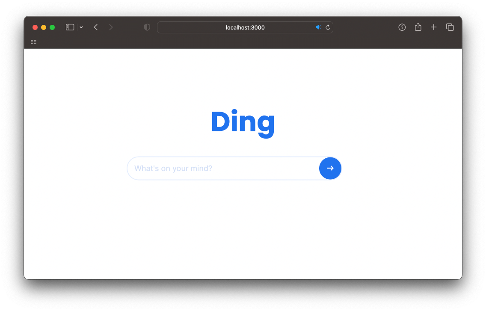

# Ding Search

Vyhledávač napsaný v Node.js, který využívá data sesbíraná [web crawlerem](https://github.com/vojhab/web-crawler).

## Dokumentace

Dokumentaci tohoto projektu najdete na [GitHub Wiki](https://github.com/vojhab/ding-search/wiki), ale ještě není zcela dokončena.

## Prezentace

Prezentace Ding search a [web crawleru](https://github.com/vojhab/web-crawler) se nachází na [vojhab.page.link/pva-prezentace](https://vojhab.page.link/pva-prezentace).

## Cíl projektu

Cílem projektu Ding Search je vytvořit vyhledávač, který bude schopen vyhledávat webové stránky a nabízet uživatelům relevantní výsledky vyhledávání na základě požadavků, které zadají. Vyhledávač je napsán v Node.js a využívá data sesbíraná [web crawlerem](https://github.com/vojhab/web-crawler).

## Použité technologie

- [Node.js](https://nodejs.org): open-source framework pro běh JavaScriptového kódu na straně serveru
- [PostgreSQL](https://www.postgresql.org): databáze, která nabízí široké spektrum funkcí pro správu a ukládání dat a umožňuje uživatelům efektivně ukládat a vyhledávat data
- [OpenAI API](https://openai.com/blog/openai-api): API pro přístup k pokročilým AI modelům
- [TensorFlow.js](https://www.tensorflow.org/js): Je open-source knihovna pro strojové učení a práci s neuronovými sítěmi, kterou lze použít v JavaScriptu jak v prohlížeči, tak i na straně serveru pomocí Node.js.

### npm balíčky

V tomto projektu jsou používány následující npm balíčky:

- [node-postgres](https://www.npmjs.com/package/pg): umožňuje přístup k PostgreSQL databázi
- [dotenv](https://www.npmjs.com/package/dotenv): načítá proměnné z .env souboru
- [ejs](https://www.npmjs.com/package/ejs): šablonovací systém pro generování HTML stránek
- [express](https://www.npmjs.com/package/express): Node.js framework pro tvorbu webových aplikací a API
- [openai](https://www.npmjs.com/package/openai): umožňuje jednoduchý přístup k OpenAI API
- [serve-favicon](https://www.npmjs.com/package/serve-favicon): poskytuje middleware pro favicony webových stránek
- [xss](https://www.npmjs.com/package/xss): ochrana proti XSS útokům, tedy proti vkládání škodlivého kódu do uživatelských vstupů, které se následně vykreslují na stránce
- [@tensorflow/tfjs](https://www.npmjs.com/package/@tensorflow/tfjs): Jedná se o npm balíček pro použití knihovny TensorFlow.js v projektu.
- [@tensorflow-models/universal-sentence-encoder](https://www.npmjs.com/package/@tensorflow-models/universal-sentence-encoder): Balíček umožňující použití modelu Universal Sentence Encoder.

## Plánované změny a funkce

- [ ] dokončení našeptávání vyhledávání
- [ ] "nekonečný scroll" s výsledky vyhledávání
- [ ] about stránka
- [ ] chatbot pro odpovídání na dotazy na základě webových stránek
- [ ] hlasové vyhledávání
- [x] použít [pgvector](https://github.com/pgvector/pgvector) pro relevantnější výsledky
- [ ] podpora pro více jazyků
- [ ] personalizované výsledky

## Licence

Tento projekt je pod licencí [MIT](LICENSE).

## Tvůrce

[Vojtěch Habeš](https://www.github.com/vojhab)

habes.vo.2022@ssps.cz
